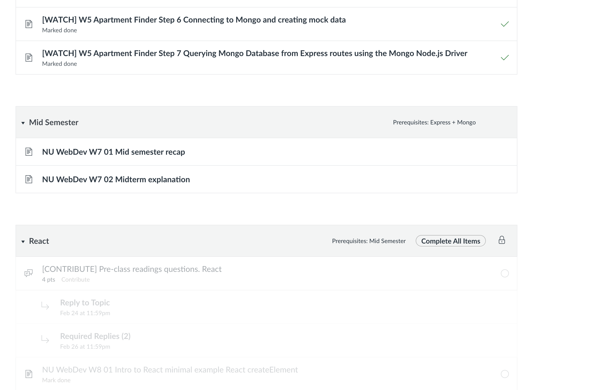

# RoomSync – Roommate Chores & Shared Expense Tracker

**Author:** Qingdong Gong  &  Alexander Sholla

---

## Project Objective

RoomSync is a full-stack web application that helps roommates manage shared household responsibilities. It provides two primary features:

1. **Chore Management** – Create, assign, track, and complete household chores with due dates and priorities.
2. **Expense Tracking** – Log shared expenses, track who paid, and see how costs are split between roommates.

The app is built with a **React** frontend (client-side rendered) communicating via AJAX (`fetch`) with a **Node.js / Express** backend, backed by **MongoDB** for persistence.

---

## Screenshot



## Webpage Thumbnail

---

## Tech Stack

| Layer    | Technology                |
|----------|---------------------------|
| Frontend | React 18, Vite, CSS       |
| Backend  | Node.js, Express          |
| Database | MongoDB (native driver)   |

---

## Getting Started

### Prerequisites

- **Node.js** v18+ and **npm**
- **MongoDB** (local or Atlas cluster)

### 1. Clone the repository

```bash
git clone https://github.com/Co1dBrew/RoomSync.git
cd RoomSync
```

### 2. Set up the backend

```bash
cd backend
npm install
cp .env.example .env
```

### 3. Seed the database (1,000 synthetic records)

```bash
npm run seed
```

### 4. Start the backend server

```bash
npm run dev
# Server starts on http://localhost:5000
```

### 5. Set up the frontend (new terminal)

```bash
cd frontend
npm install
npm run dev
# Vite dev server starts on http://localhost:5173
```

### 6. Open the app

Visit **http://localhost:5173** in your browser.

### Deployment

Live site: **https://roomsync-1-cftl.onrender.com**

---

## Project Structure

```
RoomSync/
├── backend/              # Express API server
│   ├── db/               # MongoDB connection
│   ├── routes/           # API routes (chores, expenses)
│   ├── scripts/          # Database seed script
│   └── server.js         # Entry point
├── frontend/             # React (Vite) frontend
│   └── src/
│       ├── components/   # React components (each in its own folder)
│       ├── App.jsx       # Root component
│       └── main.jsx      # Entry point
├── docs/                 # Design document
├── LICENSE               # MIT
└── README.md
```

---

## Available Scripts

### Backend (`/backend`)

| Command          | Description                |
|------------------|----------------------------|
| `npm run dev`    | Start with nodemon (HMR)   |
| `npm start`      | Start production server     |
| `npm run seed`   | Seed database with 1k records |
| `npm run lint`   | Run ESLint                  |
| `npm run format` | Run Prettier                |

### Frontend (`/frontend`)

| Command          | Description                |
|------------------|----------------------------|
| `npm run dev`    | Vite dev server             |
| `npm run build`  | Production build            |
| `npm run lint`   | Run ESLint                  |
| `npm run format` | Run Prettier                |
